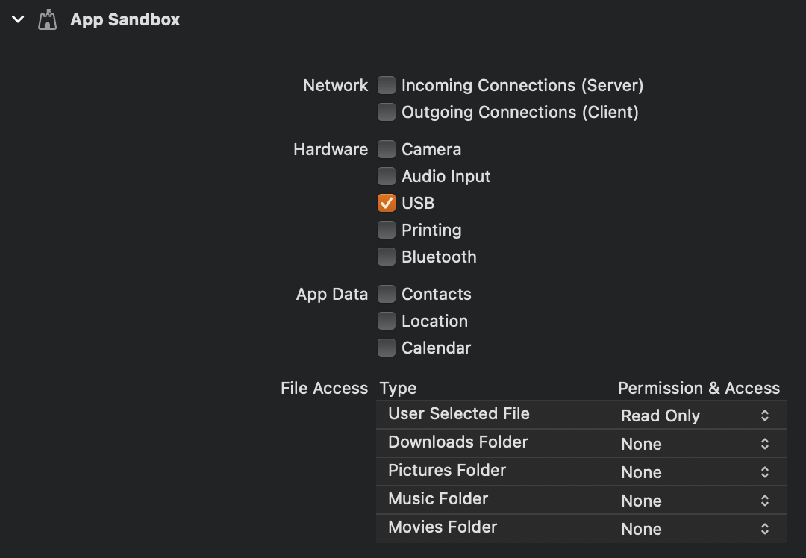
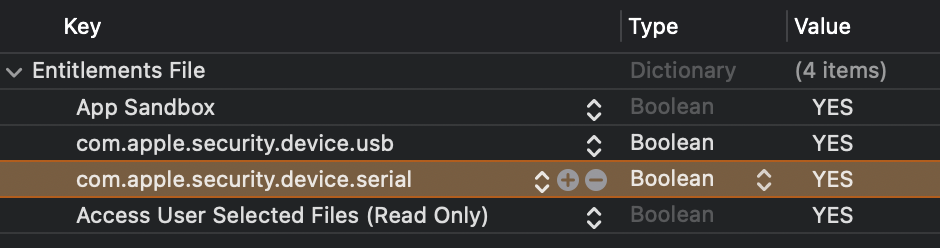
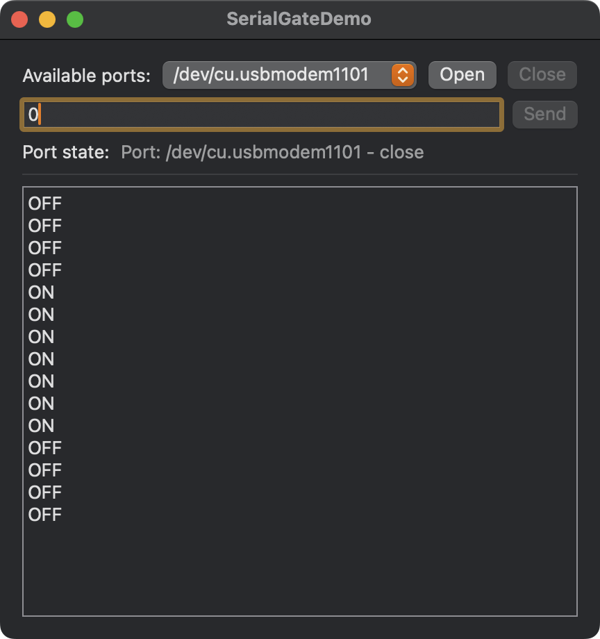

# SerialGate

Serial Communication Library for macOS written in Swift.

## Requirements

- Development with Xcode 16.0+
- Written in Swift 6.0
- Compatible with macOS 13.0+

## Installation

1. DependencyList is available through [Swift Package Manager](https://github.com/apple/swift-package-manager).
2. Put a check mark for "USB" in Capabilities of Targets (SandBox)
   
3. Edit the entitlements and add `com.apple.security.device.serial`
   

## Demo

Serial Communication Demo App for Arduino is in this Project.



Sample Arduino code is [here](Arduino/TestForSerialGate.ino).

## Usage

- Get serial ports 

```swift
import SerialGate

Task {
    for await ports in SGPortManager.shared.availablePortsStream {
        // get ports
    }
}
```

- Open a serial port

```swift
try? port.set(baudRate: B9600)
try? port.open()
```

- Close a serial port

```swift
try? port.close()
```

- Send a message

```swift
try? port.send(text: "Hello World")
// or
try? port.send(data: Data())
```

- Read messages

```swift
Task {
    for await result in port.textStream {
        switch result {
        case let .success(text):
            Swift.print(text)
        case let .failure(error):
            Swift.print(error.localizedDescription)
        }
    }
}
// or
Task {
    for await result in port.dataStream {
        switch result {
        case let .success(data):
            // use data
        case let .failure(error):
            Swift.print(error.localizedDescription)
        }
    }
}
```

- Notifications about Port State

```swift
Task {
    for await portState in port.portStateStream {
        Swift.print(String(describing: portState))
    }
}
```
